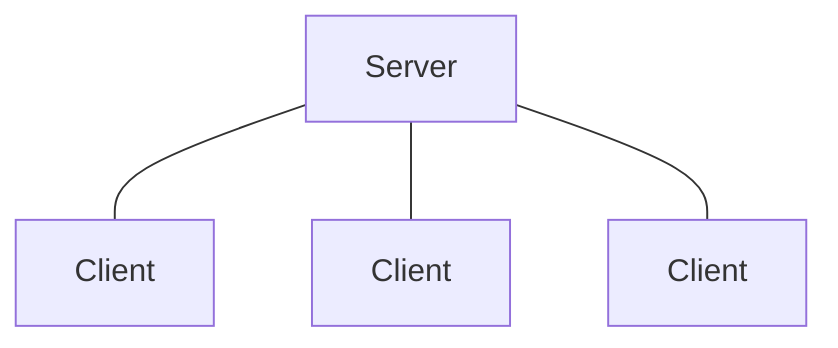

# TCP Chat server using Sockets
A chat server implemented using TCP Sockets in Python.

   
   
   

## Architecture
- Client Server architecture based on Transmission Control Protocol (TCP).
- Multiple clients connect to one central server which acts as host. 
TCP is a connection-oriented protocol that is a dependable connection protocol.
The chat application will be hosted on one server, with several clients
connecting to it and communicating with one another.

## Feautures 
* Clients (users) can join and leave the server (chat room).
* Clients can only join the server if the server authorizes it.
* Clients can send private messages to other clients (users) in the server (chat room).
## Commands
| Command | Use |
|---------------------------|:---------------------------|
| `/private <person_name> <text>` | only the client with person_name will be able to view the message |
|  `/leave` |  will let the client (user) exit from the server |
|  `/color <color> <text>` |   makes the text appear in that color |
| `**text**` |   will make <b>text</b> bold |
|  `__text__` | will make the <i>text</i> italicised |   

## To run
* Run ``server.py`` to start the chat room.
* Run ``client.py`` to start each client.
